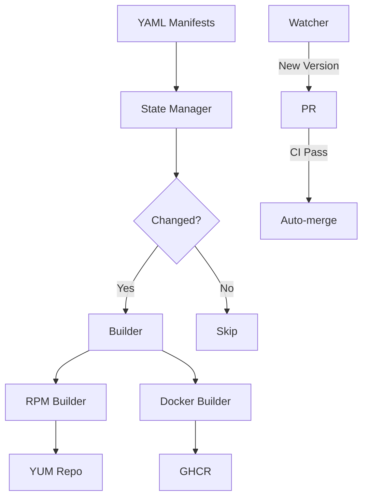

# Architecture Overview

Monitoring Hub is built as a Software Factory with automated build pipelines.

## High-Level Architecture

## Core Components

- **Builder** (`core/engine/builder.py`): Downloads binaries and generates build artifacts
- **Schema** (`core/engine/schema.py`): Validates manifest YAML files
- **State Manager** (`core/engine/state_manager.py`): Tracks changes and triggers rebuilds
- **Site Generator** (`core/engine/site_generator.py`): Generates the portal
- **Watcher** (`core/engine/watcher.py`): Monitors upstream for updates

## Build Flow

1. **Discovery**: State Manager compares local manifests with deployed catalog
2. **Generation**: Builder downloads binaries and renders templates
3. **Build**: CI builds RPM and Docker artifacts in parallel
4. **Validation**: Tests ensure packages work correctly
5. **Distribution**: Artifacts published to YUM repo and GHCR

See [Build Pipeline](build-pipeline.md) for details.
