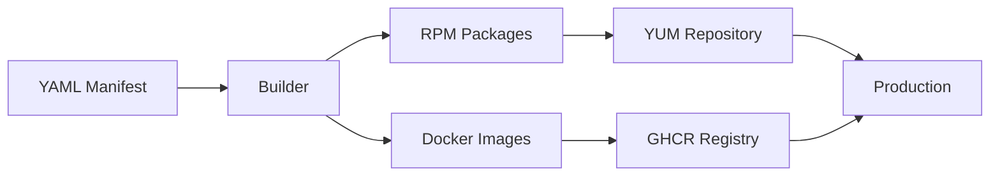

# Welcome to Monitoring Hub

**The definitive Software Factory for Prometheus Exporters.**

[](https://opensource.org/licenses/MIT)
[](https://github.com/SckyzO/monitoring-hub/actions/workflows/release.yml)
[](https://github.com/SckyzO/monitoring-hub/actions/workflows/scan-updates.yml)

---

## 🎯 Project Goal

**Monitoring Hub** is an automated Software Factory that transforms simple YAML manifests into production-ready monitoring tools. It focuses on **Enterprise Standards**, **Multi-Architecture support**, and **Full Automation**.

## 🚀 Key Features

- **Native Multi-Arch:** Every tool is built for `x86_64` and `aarch64` (ARM64)
- **Hardened Security:** All Docker images use Red Hat UBI 9 Minimal
- **Linux Standard (FHS):** RPMs include system users, standard paths, and systemd integration
- **Zero-Click Updates:** Automated watcher opens PRs and merges when tests pass
- **Always Up-to-Date:** Never worry about upstream releases again

## 📦 What's Included

The factory currently builds and maintains **30+ Prometheus exporters**, including:

- **System Monitoring:** node_exporter, process_exporter, systemd_exporter
- **Database:** postgres_exporter, mysql_exporter, mongodb_exporter, redis_exporter
- **Web Services:** nginx_exporter, apache_exporter, blackbox_exporter
- **Storage:** ceph_exporter, ipmi_exporter, smartctl_exporter
- **Messaging:** kafka_exporter, rabbitmq_exporter, nats_exporter
- **And many more...**

[Browse the complete catalog →](https://sckyzo.github.io/monitoring-hub/){ .md-button .md-button--primary }

## 📚 Quick Links

<div class="grid cards" markdown>

- :fontawesome-solid-rocket: **[Quick Start](getting-started/quick-start.md)**

    Get up and running in minutes

- :fontawesome-solid-book: **[User Guide](user-guide/adding-exporters.md)**

    Learn how to add new exporters

- :fontawesome-solid-layer-group: **[Architecture](architecture/overview.md)**

    Understand how it works

- :fontawesome-solid-code: **[API Reference](api-reference/builder.md)**

    Explore the codebase

</div>

## 🏭 How It Works



1. **Define**: Create a simple YAML manifest describing the exporter
2. **Build**: Automated CI builds RPM and Docker artifacts
3. **Distribute**: Packages are published to YUM repo and GHCR
4. **Update**: Watcher monitors upstream and auto-updates

## 📋 Distribution

### YUM Repository (RPM)

```bash
# Configure repository
sudo dnf config-manager --add-repo https://sckyzo.github.io/monitoring-hub/el9/$(arch)/

# Install any exporter
sudo dnf install node_exporter

# Enable and start
sudo systemctl enable --now node_exporter
```

### Container Registry (Docker)

```bash
# Pull any exporter
docker pull ghcr.io/sckyzo/monitoring-hub/node_exporter:latest

# Run
docker run -d -p 9100:9100 ghcr.io/sckyzo/monitoring-hub/node_exporter:latest
```

## 🤝 Contributing

We welcome contributions! Check out our [Contributing Guide](contributing/development.md) to get started.

## 📄 License

Distributed under the MIT License. See [LICENSE](https://github.com/SckyzO/monitoring-hub/blob/main/LICENSE) for more information.
